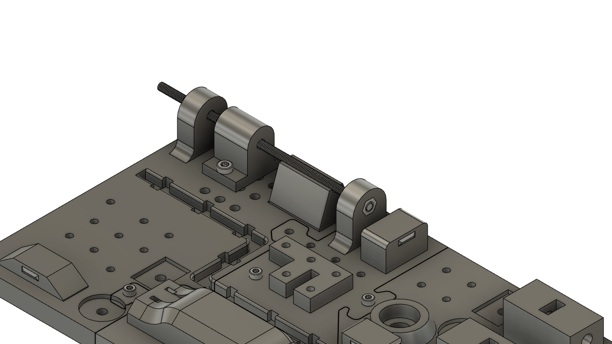

# Work Instruction - MONA

## Work Step 1 -- Place base plate

**Part(s)**: BP_123\
**Tool(s):** -

**Description:** Place the pre-assembled base plate on the table in
front of you.

## Work Step 2 -- Assemble work piece

**Part(s):** TL_M4_Hole, 2x M4x14mm\
**Tool(s):** Allen key 3

**Description:** Place the part in the position shown and fix it to the
base plate with two M4x14mm screws.

## Work Step 3 -- Werkstück positionieren

**Part(s):** TL_M4_Rest**\
Tool(s):** -

**Description:** Position the part at the position shown

## Work Step 4 -- Mount threaded rod

**Part(s):** 1x M4 nut, 1x M4 120mm threaded rod **\
Tool(s):** -

**Description:** Position an M4 nut in the position shown and slide the
threaded rod into the position shown. Screw it into the placed M4 nut.

## Work Step 5 -- Assemble work piece

**Part(s):** TR_Screw_Block, 4x M3x12mm **\
Tool(s):** Allen key 2

**Description:** Place the part in the position shown.\
Fasten the work piece with four M3x12mm screws.

## Work Step 6 - Assemble work piece

**Part(s):** TR_M6_Corner, 2x M6 Nut, 2x M6x25mm Screws**\
Tool(s):** Allen key 5

**Description:** Place the parts on the designated position as shown.\
Insert two M6 nuts into the marked recesses.\
Then fasten the work piece with two M6x25mm screws.

## Work Step 7 -- Lay and fasten cables

**Part(s):** 1x 20cm cable, 7x Cable_Clip**\
Tool(s):** -

**Description:** Place the 20 cm long cable in the marked cable duct.\
Then insert the cable clips into the recesses provided to secure the
cable.

## Work Step 8 -- Assemble work piece

**Part(s):** TM_Attachment, 3x M3x20mm **\
Tool(s):** Allen key 2.5

**Description:** Place the part at the indicated position.\
Attach it with three M3x20mm screws.

## Work Step 9 -- Assemble work piece

**Part(s):** BL_Block, 3x M3x12mm **\
Tool(s):** Allen key 2

**Description:** Place the workpiece at the indicated position.\
Insert and tighten the three shown M3x12mm screws.

## Work Step 10 -- Assemble work piece

**Part(s):** BL_Block_Top, 3x M3x16mm **\
Tool(s):** Allen key 2.5

**Description:** Place the part at the shown position.\
The middle part of it rests on the part from the previous step.\
Secure the part with three M3x16mm screws.

## Work Step 11 -- Lay and secure cable

**Part(s):** 1x 10cm cable loom, 2x 2,5mm cable ties**\
Tool(s):** cable clamp

**Description:** Guide the cable loom through the indicated cable duct.\
Fix the cable loom with two cable ties in the recesses provided.\
Remove the excess end of the cable tie.

## Work Step 12 -- Assemble screw

**Part(s):** 1x M4x20mm, 1x M4 Nut**\
Tool(s):** Allen key 3

**Description:** Assemble the M4 Screw and M4 nut as shown.

## Work Step 13 -- Attach columns

**Part(s):** 2x BR_Column, 4x M3x12mm **\
Tool(s):** Allen key 2

**Description:** Place the two workpieces on the Base plate as shown.\
Mount the two columns with four M3x12mm screws.

## Work Step 14 -- Mount connection piece

**Part(s):** BR_Connector, 1x M4x30mm **\
Tool(s):** Allen key 3

**Description:** Place the part on the two columns and fix it with the
M4 Screw.\
Be careful not to brake the part!

## Work Step 15 -- Assemble work piece

**Part(s):** M4_Attachment_Cylinder, 1x M4x20mm , 1x M4 Nut**\
Tool(s):** Allen key 3

**Description:** Place and attach the tower in the position shown.\
The screw must be tightened from the underside of the base plate.

## Work Step 16 -- Place and assemble parts

**Part(s):** 1x M4_Attachment_Cylinder, 2x M4_Attachment_Square, 3x
M4x20mm, 3x M4 Nut**\
Tool(s):** Allen key 3

**Description:** Repeat the last work step with the three parts shown.

## Work Step 17 -- Mount clips 

**Part(s):** 3x Top_Clip\
**Tool(s):** -

**Description:** Put the clips in the positions illustrated.

## Work Step 18 -- insert ball bearing

**Part(s):** 1x 606zz ball bearing\
**Tool(s):** -

**Description:** Insert the ball bearing into the position shown.

