# Arbeitsanweisung MONA

## Arbeitsschritt 1 -- Grundplatte auflegen

**Werkstück(e)**: BP_123\
**Werkzeug(e):** -

**Beschreibung:** Legen Sie die vormontierte Grundplatte vor sich auf
den Tisch

## Arbeitsschritt 2 -- Werkstück montieren

**Werkstück(e):** TL_M4_Hole, 2x M4x14mm\
**Werkzeug(e):** Inbusschlüssel 3

**Beschreibung:** Setzen Sie das Werkstück(e) auf die abgebildete
Position und befestigen es mit zwei M4x14mm Schrauben an der
Grundplatte.

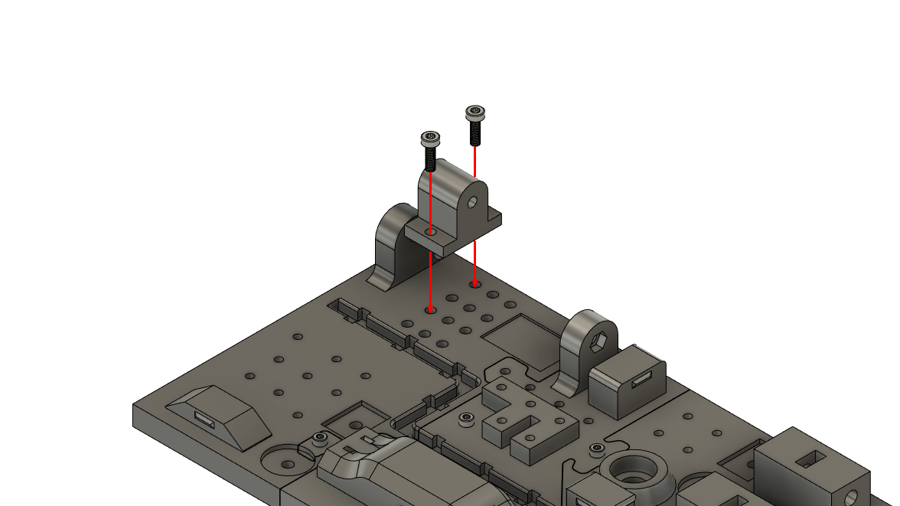

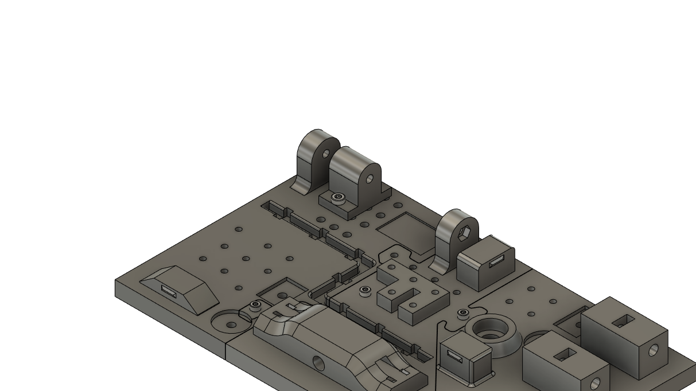

## Arbeitsschritt 3 -- Werkstück positionieren

**Werkstück(e):** TL_M4_Rest\
**Werkzeug(e):** -

**Beschreibung:** Positionieren Sie das Werkstück an der gezeigten
Position

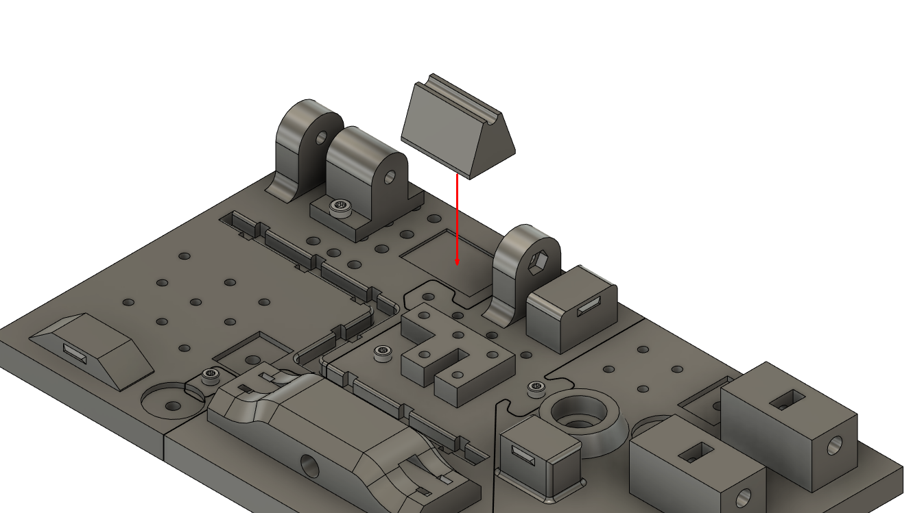

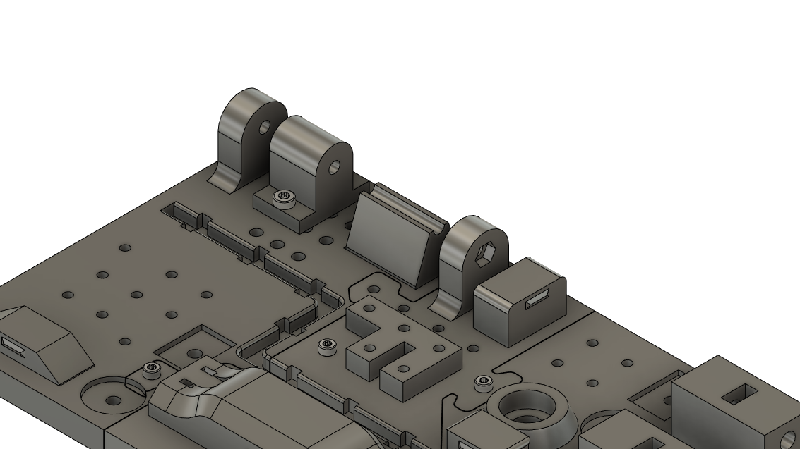

## Arbeitsschritt 4 -- Gewindestange montieren

**Werkstück(e):** 1x M4 Mutter, 1x M4 Gewindestange 120mm\
**Werkzeug(e):** -

**Beschreibung:** Positionieren Sie eine M4 Mutter an gezeigter Position
und schieben die Gewindestange in die abgebildete Position. Verschrauben
Sie diese mit der platzierten M4 Mutter.

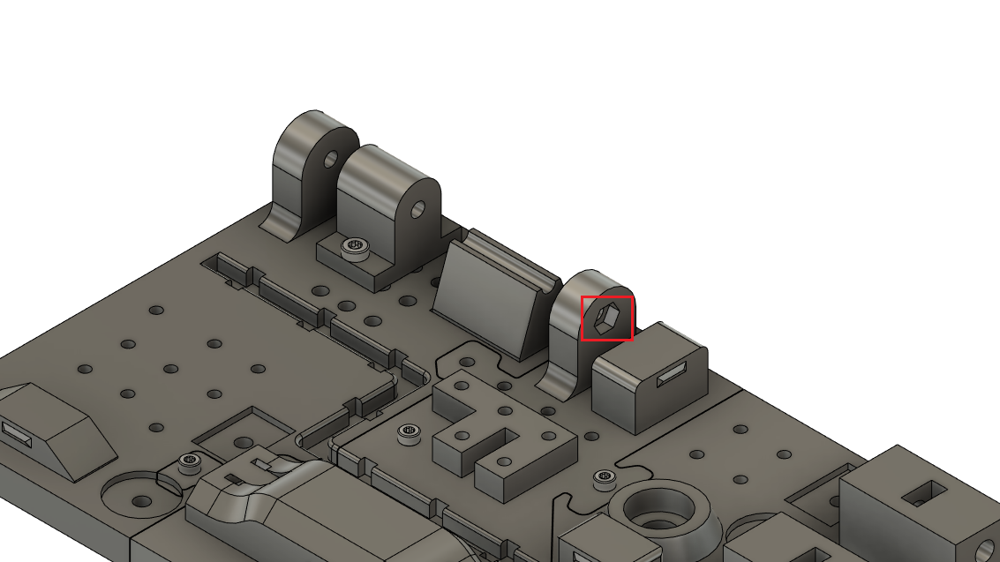

## Arbeitsschritt 5 -- Werkstück montieren

**Werkstück(e):** TR_Screw_Block, 4x M3x12mm \
**Werkzeug(e):** Inbusschlüssel 2

**Beschreibung:** Setzen Sie das Werkstück auf die abgebildete Position.
Befestigen sie das Werkstück mit vier M3x12mm Schrauben.

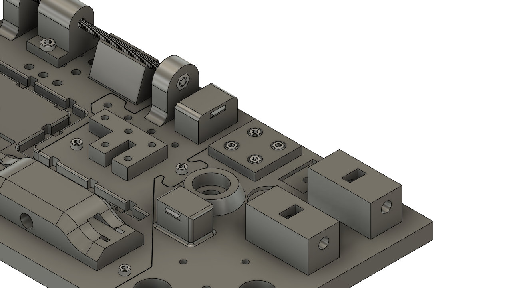

## Arbeitsschritt 6 - Werkstück montieren

**Werkstück(e):** TR_M6_Corner, 2x M6 Mutter, 2x M6x25mm Schrauben\
**Werkzeug(e):** Inbusschlüssel 5

**Beschreibung:** Legen Sie das Werkstück wie abgebildet auf die dafür
vorgesehene Position. Stecken Sie zwei M6 Muttern in die markierten
Ausnehmungen. Befestigen Sie anschließend das Werkstück mit zwei M6x25mm
Schrauben.

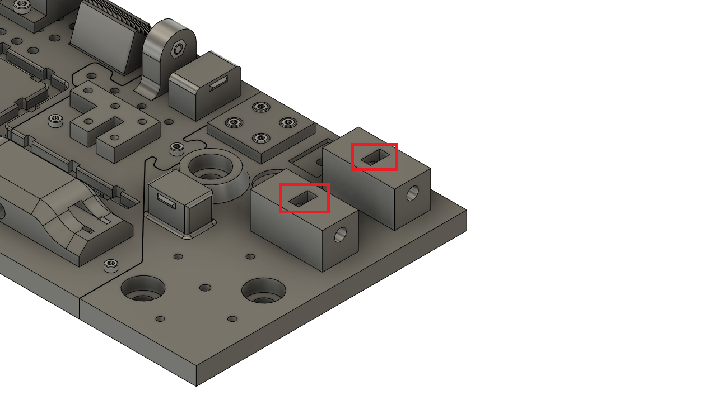

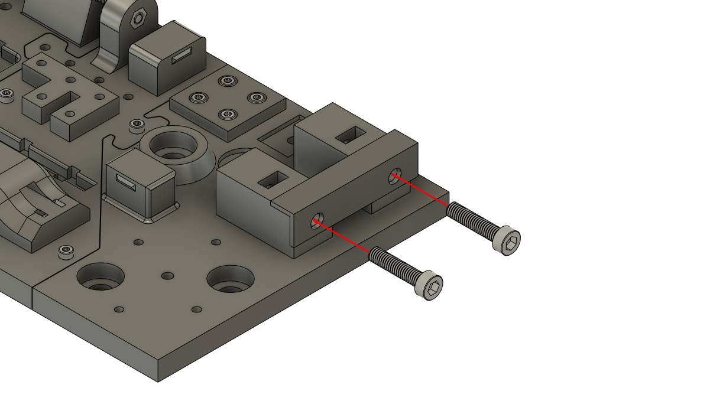

## Arbeitsschritt 7 -- Kabel legen und befestigen

**Werkstück(e):** 1x 20cm Kabel, 7x Cable_Clip\
**Werkzeug(e):** -

**Beschreibung:** Legen Sie das 20cm lange Kabel in den markierten
Kabelkanal. Danach stecken Sie die Kabelclips in die dafür vorgesehenen
Ausnehmungen um das Kabel zu fixieren

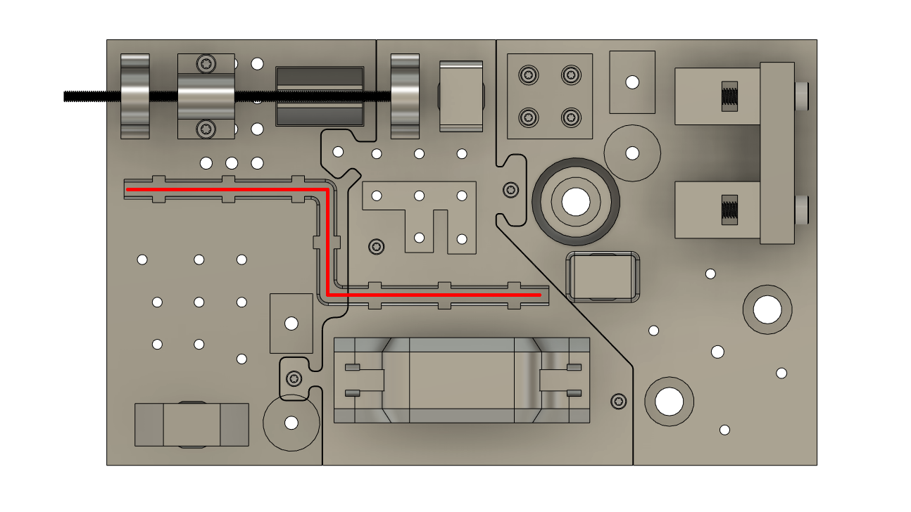

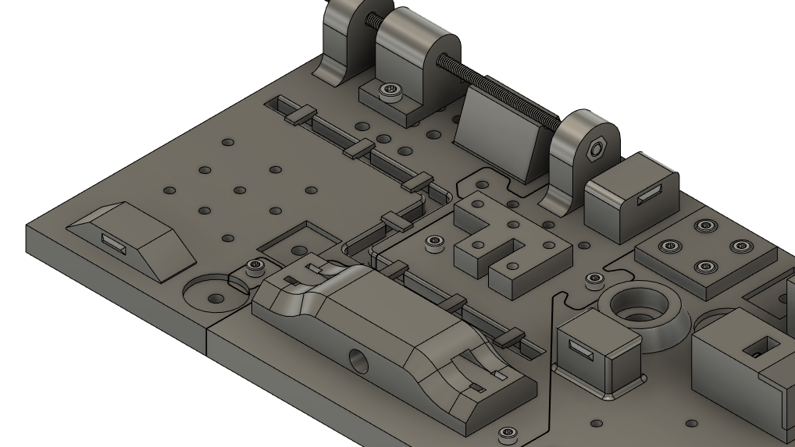

## Arbeitsschritt 8 -- Werkstück montieren

**Werkstück(e):** TM_Attachment, 3x M3x20mm\
**Werkzeug(e):** Inbusschlüssel 2.5

**Beschreibung:** Platzieren Sie das Werkstück an der angezeigten
Position. Befestigen das Werkstück mit drei M3x20mm Schrauben.

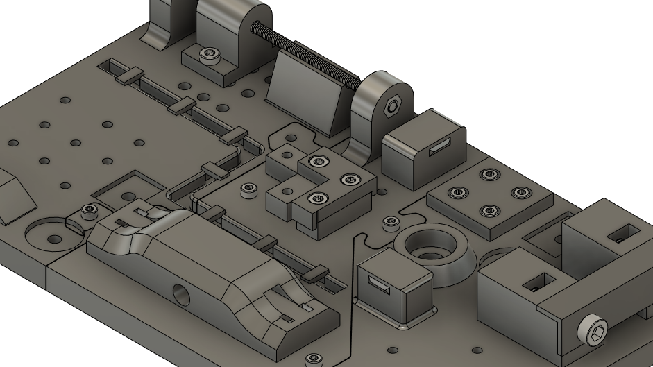

## Arbeitsschritt 9 -- Werkstück montieren

**Werkstück(e):** BL_Block, 3x M3x12mm \
**Werkzeug(e):** Inbusschlüssel 2

**Beschreibung:** Platzieren Sie das Werkstück an der angezeigten
Position. Befestigen Sie nun das Werkstück mit drei M3x12mm Schrauben.

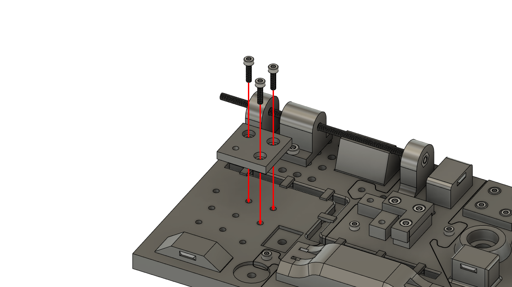

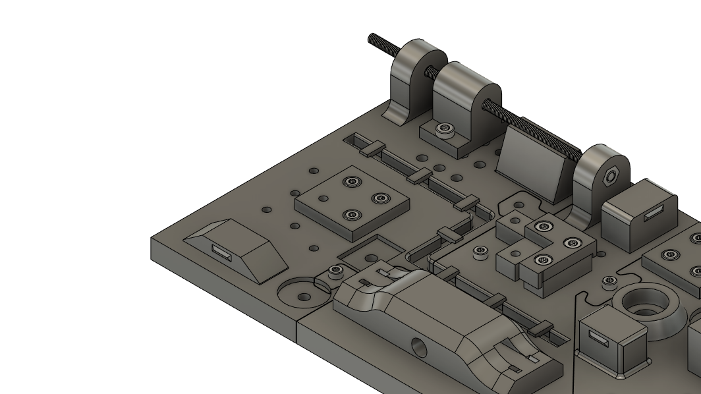

## Arbeitsschritt 10 -- Werkstück montieren

**Werkstück(e):** BL_Block_Top, 3x M3x16mm\
**Werkzeug(e):** Inbusschlüssel 2.5

**Beschreibung:** Platzieren Sie das Werkstück an der angezeigten
Position.\
Der mittlere Teil des Werkstücks liegt auf dem Werkstück des vorherigen
Schrittes auf.\
Befestigen Sie das Werkstück mit drei M3x16mm Schrauben.

## Arbeitsschritt 11 -- Kabel legen und fixieren

**Werkstück(e):** 1x 10cm Kabelstrang, 2x 2,5mm Kabelbinder\
**Werkzeug(e):** Kabelzange

**Beschreibung:** Führen Sie den Kabelstrang durch den angezeigten
Kabelkanal.\
Fixieren Sie den Kabelstrang mit zwei Kabelbindern in den dafür
vorgesehenen Ausnehmungen.\
Entfernen Sie das überstehende Ende des Kabelbinders

## Arbeitsschritt 12 -- Schraube befestigen

**Werkstück(e):** 1x M4x20mm, 1x M4 Mutter\
**Werkzeug(e):** Inbusschlüssel 3

**Beschreibung:** Befestigen Sie die M4 Schraube und M4 Mutter wie
abgebildet.

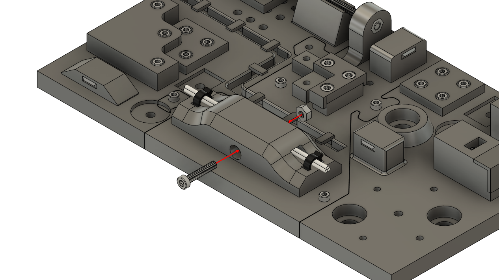

## Arbeitsschritt 13 -- Säulen montieren

**Werkstück(e):** 2x BR_Column, 4x M3x12mm\
**Werkzeug(e):** Inbusschlüssel 2

**Beschreibung:** Platzieren Sie die zwei Werkstücke wie abgebildet auf
der Grundplatte.\
Montieren Sie die zwei Säulen wie angezeigt.

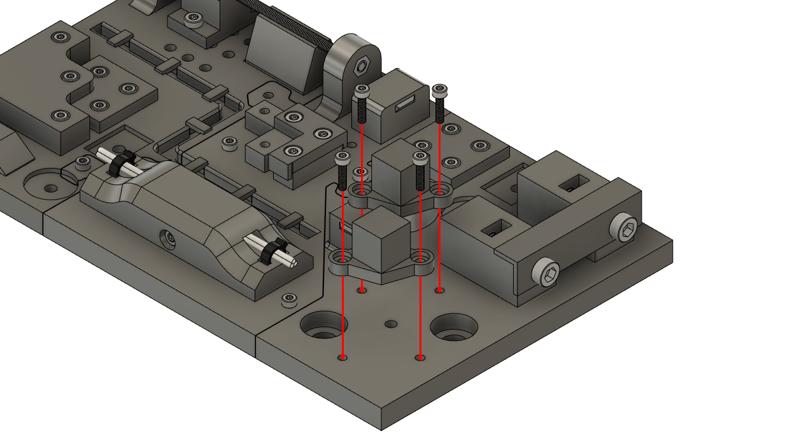

## Arbeitsschritt 14 -- Verbindung befestigen

**Werkstück(e):** BR_Connector, 1x M4x30mm\
**Werkzeug(e):** Inbusschlüssel 3

**Beschreibung:** Platzieren Sie das Werkstück auf den beiden Säulen und
befestigen es mit der M4 Schraube wie abgebildet.\
Achten Sie darauf, dass Sie das Teil nicht brechen!

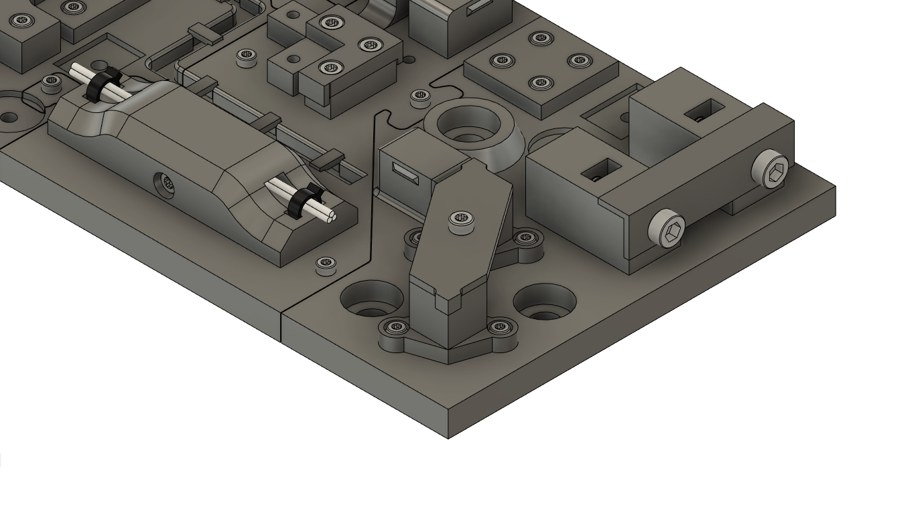

## Arbeitsschritt 15 -- Werkstück montieren

**Werkstück(e):** M4_Attachment_Cylinder, 1x M4x20mm , 1x M4 Mutter\
**Werkzeug(e):** Inbusschlüssel 3

**Beschreibung:** Platzieren Sie den Turm an der gezeigten Position.
Befestigen Sie diesen anschließend wie abgebildet. Die Schraube muss von
der Unterseite der Grundplatte angezogen werden.

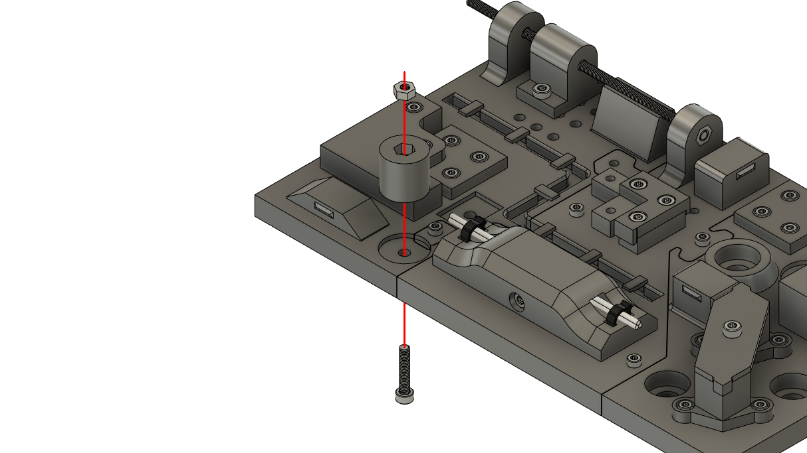

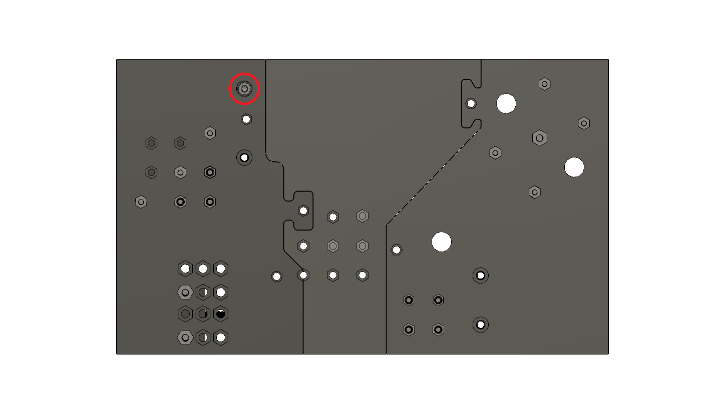

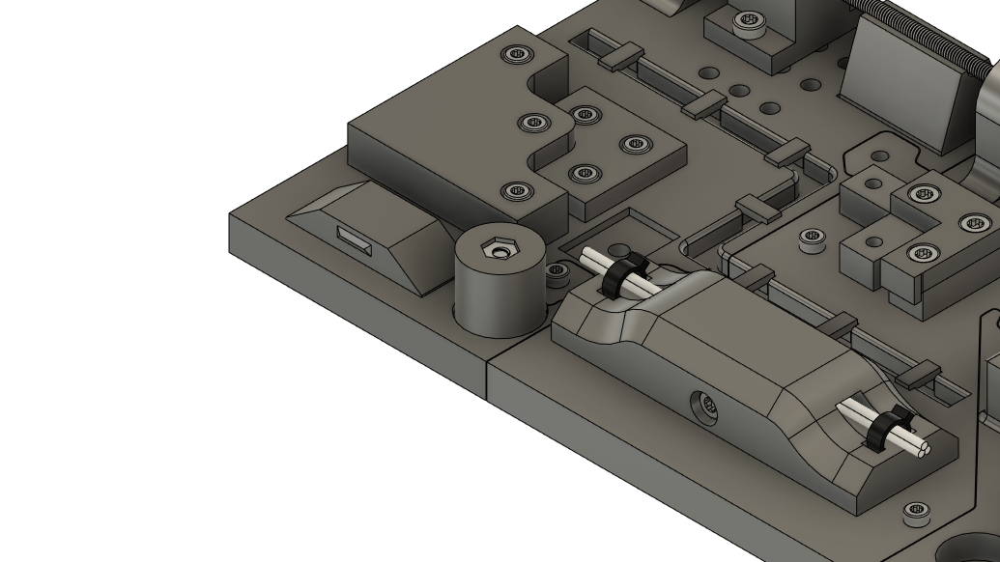

## Arbeitsschritt 16 -- Werkstück platzieren und befestigen

**Werkstück(e):** 1x M4_Attachment_Cylinder, 2x M4_Attachment_Square, 3x
M4x20mm, 3x M4 Mutter\
**Werkzeug(e):** Inbusschlüssel 3

**Beschreibung:** Wiederholen Sie den letzten Arbeitsschritt mit den
drei gezeigten Werkstücken.

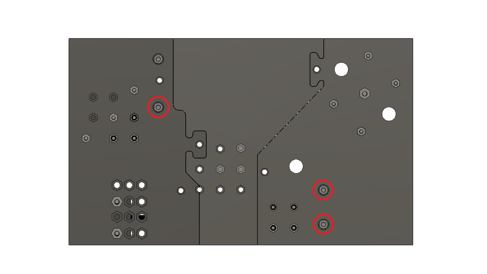

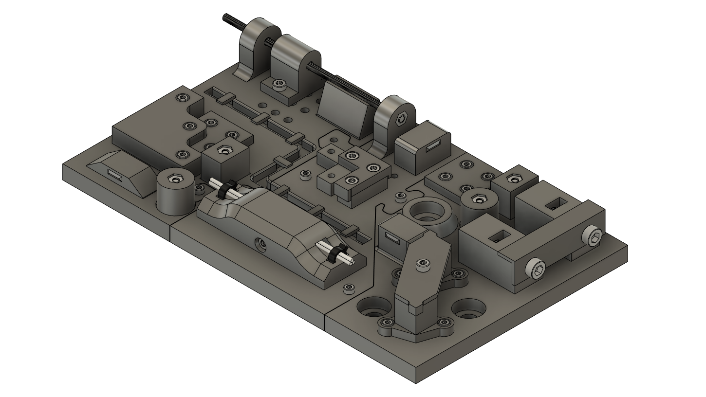

## Arbeitsschritt 17 -- Clips befestigen 

**Werkstück(e):** 3x Top_Clip\
**Werkzeug(e):** -

**Beschreibung:** Stecken Sie die Clips auf die gezeigten Positionen.

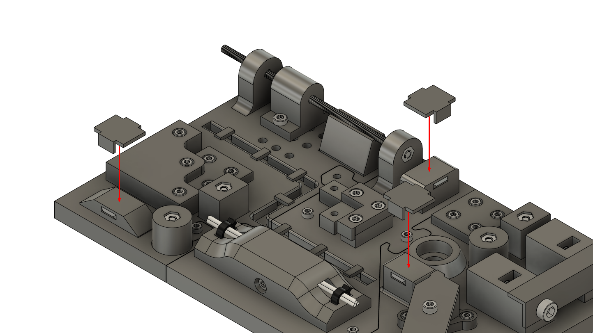

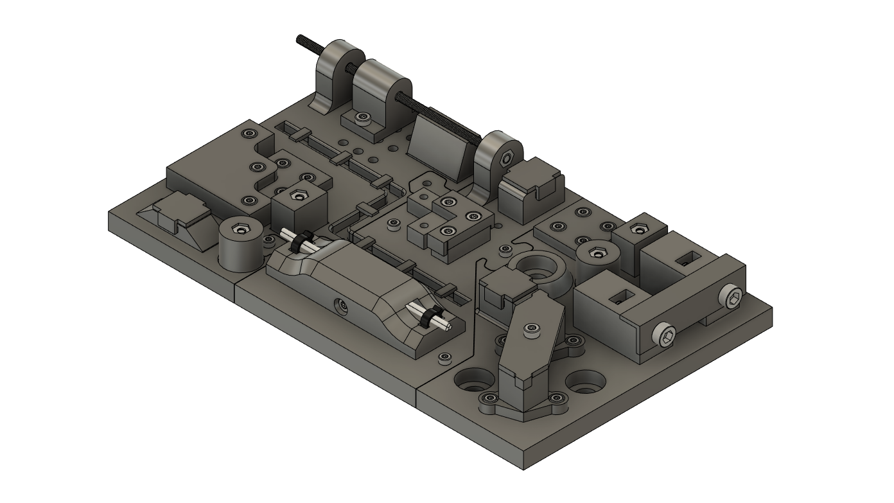

## Arbeitsschritt 18 -- Kugellager einstecken

**Werkstück(e):** 1x 606zz Kugellager\
**Werkzeug(e):** -

**Beschreibung:** Stecken Sie das Kugellager in die abgebildete Position

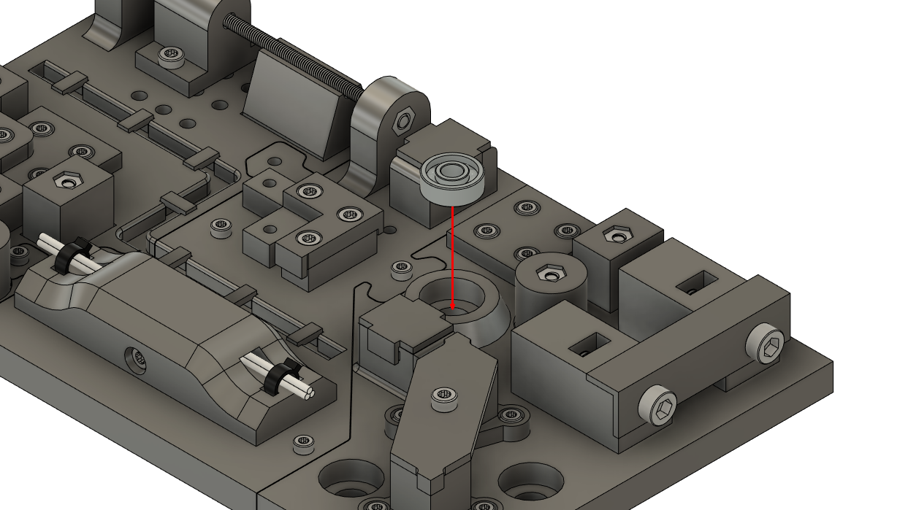

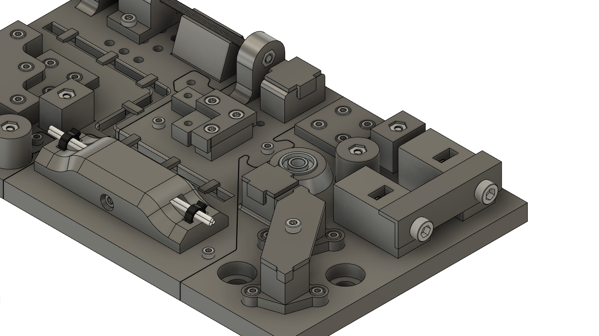